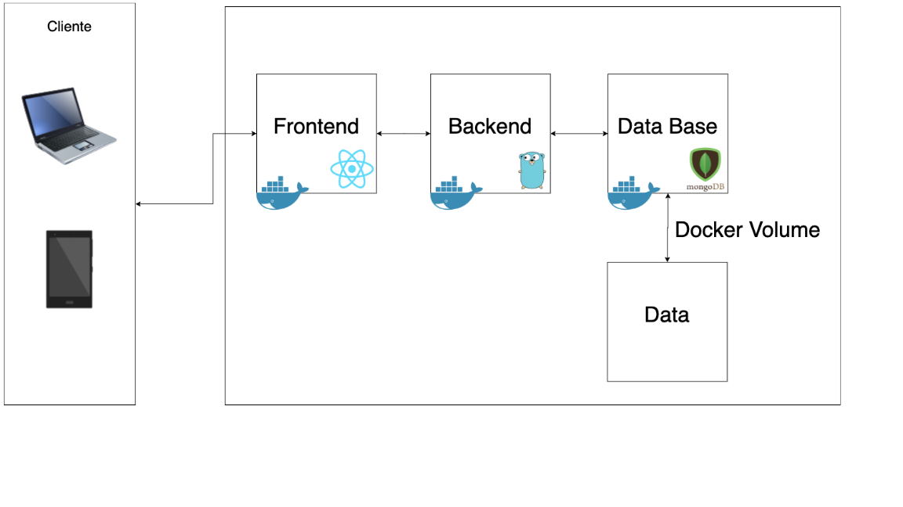

# Manual Tecnico

Calculator es una aplicación web realizada por medio de ReactJS, para el frontend, Go, para el Backend y MongoDB como base de datos. Tambien se utilzó Docker para generar imágenes individuales de cada parte de la aplicación y Docker Compose para la orquestación de los mismos. 

## Arquitectura


La arquitectura consiste en un MVC, donde el frontend, el backend y la base de datos corren en contenedores individuales. 

### Modelo
El modelo se implementó por medio de una base de datos en MongoDB versión 5.0.6. La imagen de MongoDB que se utilizó es mongo:5.0.6-focal. Además, se utilizó un volúmen para que los datos persistan. El volúmen lo genera en la carpeta [Database](./../database).

`Puerto: 27017`

### Vista 

La vista se realizó por medio de la libreria ReactJS en la version 17.0.2. Para la versión de producción se utilizó Nginx como servidor de archivos estáticos. Para los estilos se utilzó [bootstrap](https://getbootstrap.com/) en la versión 5.1.3. 

#### Generar Nueva Version

Para hacer cambios se necesita utilizar el comando: 
```
npm run build
```
Para generar en la carpeta [build](./../frontend/calculator/build/) una versión estática de la aplicación. 
Posteriormente, se puede generar la imágen con el siguiente comando: 
```
docker build -t villa01/frontend_p1_201900907 .
```

En el archivo [Dockerfile](./../frontend/Dockerfile) se encuentra la la configuración para realizar una imágen de Nginx, copiar el [archivo de configuración](./../frontend/nginx.conf) del servidor y copiar la carpeta [build](./../frontend/calculator/build/) dentro del contenedor. 

#### Organizacion del Frontend

```
frontend:.
├───build
│   └───static
│       ├───css
│       └───js
├───public
└───src
    ├───Components
    │   ├───Calculator.js
    │   ├───Calculator.css
    │   ├───CalculatorButton.js
    │   ├───CalculatorNumericalPad.js
    │   ├───CalculatorTable.js
    │   └───CalculatorReports.js
    ├───App.js
    ├───App.css
    ├───index.css
    ├───index.js
    └───setupTests.js
```
En la carpeta [Components](./../frontend/src/Components/) se encuentran los componentes necesarios para la organización de la calculadora. 

### Controlador
El backend se implementó en Go con la imagen de docker 1.16-alpine. Para la realización de una API funcional se utilizó [Gorilla Mux](https://github.com/gorilla/mux).

#### Generar Nueva Version

Se puede generar una nueva imagen del backend con el siguiente comando: 
```
docker build -t villa01/backend_p1_201900907 .
```

En el archivo [Dockerfile](./../backend/dockerfile) se encuentra la configuración para realizar una imágen Go, copiar y descarga de los archivos de dependencias y la compilación y ejecución del programa. La api está expuesta en el `Puerto:8080`.

#### Endpoints
| Ruta | Metodo | Descripción |
|------|--------|-------------|
| / | GET | Ruta de prueba para determinar si la API está en funcionmaniento | 
| /doOperation | POST | Se espera una peticion con la información de una operación. |
| getOperations | GET | Se obtienen todas operaciones guardadas en la base de datos. 