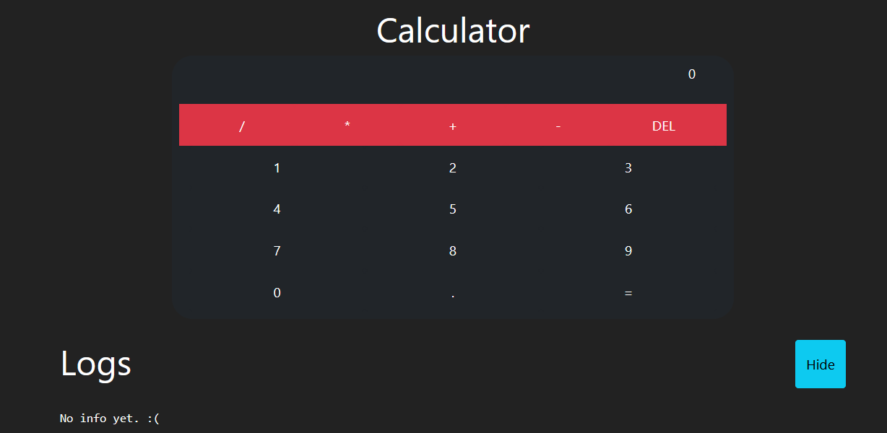
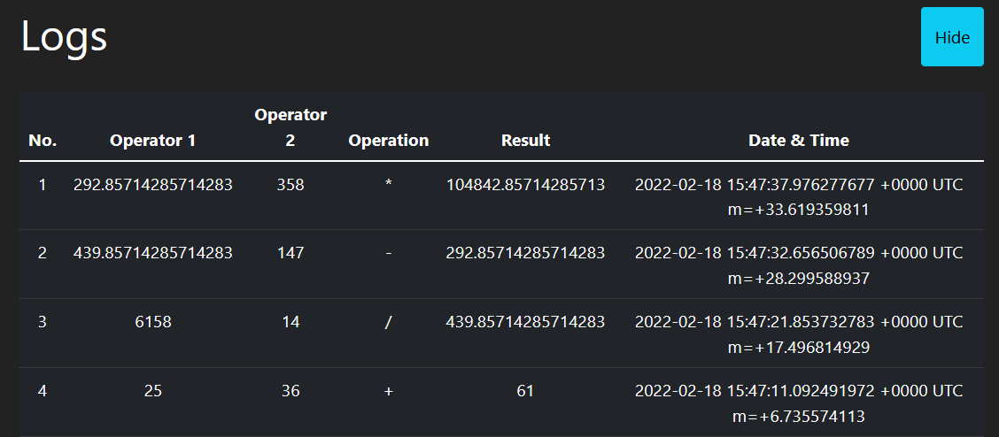
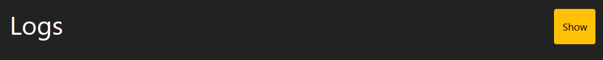

# Manual de Usuario

## Indice 📚
- [Utilización](#utilizacion)

<div id="utilizacion">

## Utilización
### Prerequisitos
- Docker Engine / Desktop
- Docker compose

Para utilizar la aplicación se debe utilizar el archivo [docker-compose.yml](./../docker-compose.yml), por medio del comando:
```
docker-compose up -d
```
Este comando procederá ejecutar la aplicación y podrá ser accedida desde el `http://localholst:80` .

## Vista General
A continuación una vista general de la aplicación.


Se puede observar dos principales secciones.
La primer sección tiene las operaciones posibles en color rojo.Las posibles operaciones son suma, resta, multiplicación y división. 

### Calculadora

Para realizar una operación se deben seguir los siguientes pasos:
1. Ingresar el primer número con los botones.
2. Seleccionar la operación a realizar. 
3. Ingresar el segundo número con los botones. 
4. Tocar el botón `=` .

El resultado aparecerá en la pantalla a continuación. También se puede tocar el botón `DEL` para borrar la pantalla.

### Registros
En la sección de registros aparecerán las operaciones que se realizaron anteriormente. 


Con el botón `Hide` se pueden ocultar todos los registros y con el botón `Show` es posible mostrarlos nuevamente. 

